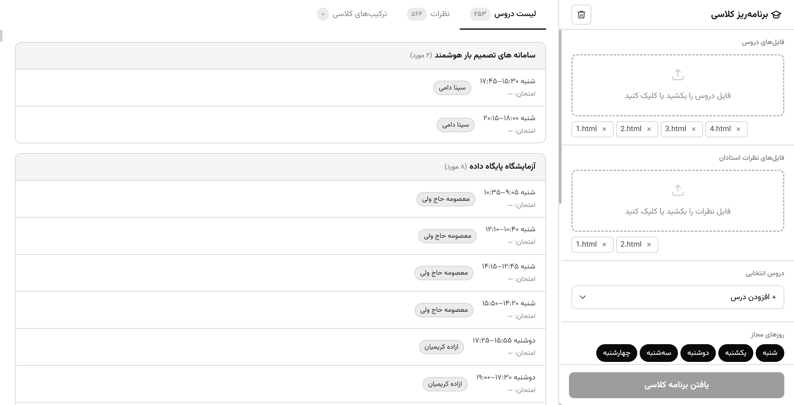
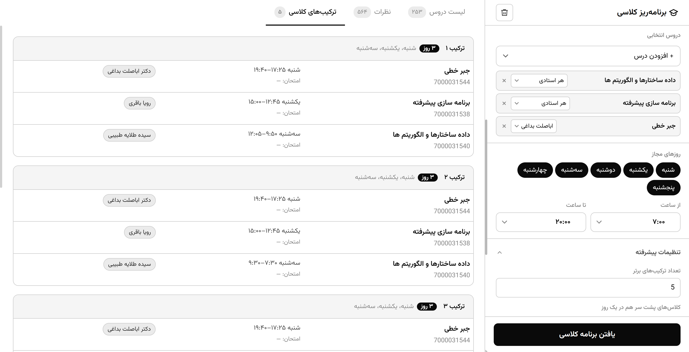
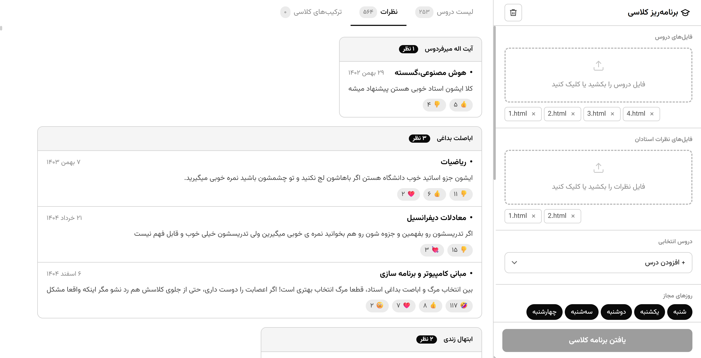

# Class Scheduler
[فارسی](/README.fa.md)

> A shortcut for semester planning at Azad University

<p>
  
</p>


## The Course Registration Challenge

Every semester we have to choose classes from **a huge number of classes**
on the university website in a way that we spend the **fewest possible days**
at the university. Then we have to check students' opinions about
professors in the Telegram channel
to avoid ending up with a difficult professor.
This process takes about 2 to 3 hours every semester.
Therefore, we invented a shortcut.


## The Shortcut

**Class Scheduler** extracts course information from the [eserv.iau.ir](https://eserv.iau.ir/) portal and also
retrieves professor reviews from the Telegram channel
[@wtiau_asatid](https://t.me/wtiau_asatid), and finds all possible combinations.


### How to Obtain Course Files

1. Go to [https://eserv.iau.ir/](https://eserv.iau.ir/)
2. **Academic Semester Planning** → **Search Offered Course Classes**
3. Set **Number of Search Results Per Page** to the maximum
4. Save the entire page as an `html` file using **Ctrl+S**

### How to Obtain Professor Review Files

1. Go to the Telegram channel [@wtiau_asatid](https://t.me/wtiau_asatid)
2. Click the **three dots (⋮)** in the top right corner → **Export chat history**
3. Click **Export** and download the file
4. Inside the downloaded folder, you will find the `html` files


## How to Use

1. Upload the **course `html` files**
2. Upload the **professor review `html` files**
3. Filter courses based on **course name** and **professor name**
4. Apply your preferred settings: `Allowed days`, `Time range`, `Gap between classes`, `Number of combinations`
5. Click the **Find Class Schedule** button
6. Review the professor opinions

```bash
pip install -r requirements.txt

uvicorn src.main:app --reload
```


## Screenshots

<p align="center">
  
  
  
</p>


Built
with [Jinja2](https://jinja.palletsprojects.com/), [BeautifulSoup](https://www.crummy.com/software/BeautifulSoup/), [FastAPI](https://fastapi.tiangolo.com/)
and [OpenRouter](https://openrouter.ai/)
